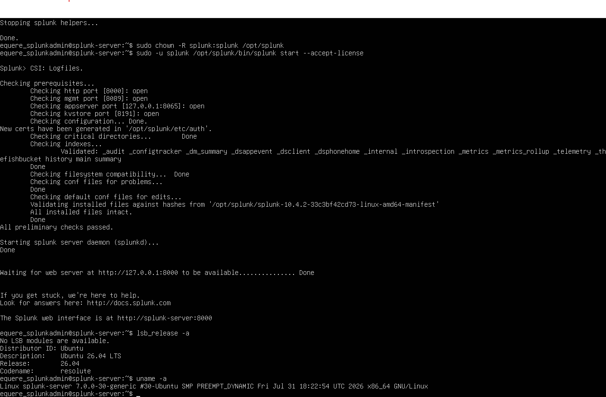
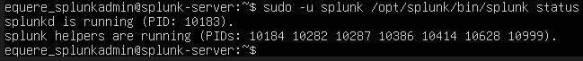
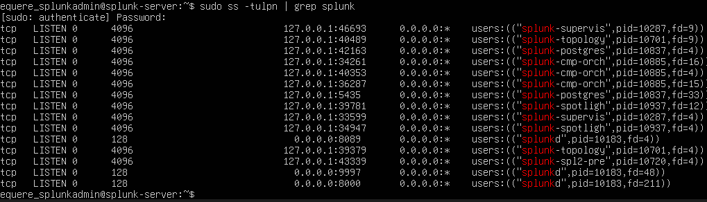
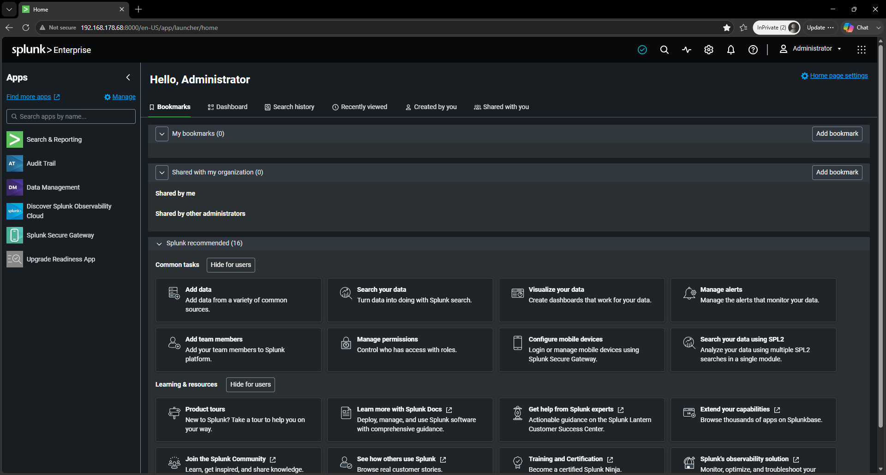
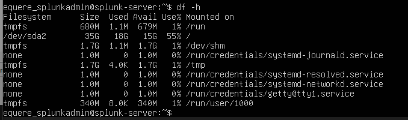

# Deployment Evidence

This directory contains visual evidence supporting the deployment and infrastructure validation of the enterprise-inspired SIEM laboratory.

The evidence demonstrates the progression from the underlying Ubuntu Server platform through Splunk service validation, network exposure, Splunk Web availability, and infrastructure baseline verification.

---

## Evidence Chain

```text
Ubuntu Server Platform
        ↓
Splunk Enterprise Service
        ↓
Network / Port Validation
        ↓
Splunk Web Availability
        ↓
Infrastructure Baseline
````

---

## Evidence Register

| Evidence                       | Validation                                                                       |
| ------------------------------ | -------------------------------------------------------------------------------- |
| `02-ubuntu-server-version.png` | Confirms the Ubuntu Server platform and kernel baseline                          |
| `03-splunk-status.png`         | Confirms that the Splunk daemon and supporting processes are running             |
| `04-splunk-ports.png`          | Confirms Splunk network listeners including Web, management, and receiving ports |
| `D03-splunk-web.png`           | Demonstrates operational access to the Splunk Web interface                      |
| `14-system-baseline.png`       | Demonstrates filesystem and storage state of the SIEM server                     |

---

## 01 — Ubuntu Server Platform



This evidence establishes the Linux platform used as the SIEM server.

The laboratory was operated on Ubuntu Server 25.04.

---

## 02 — Splunk Service Validation



This evidence demonstrates that the Splunk service was running and that the Splunk helper processes were operational.

---

## 03 — Splunk Network Ports



This evidence demonstrates the network listeners required for the laboratory architecture.

Relevant services include:

* TCP 8000 — Splunk Web
* TCP 8089 — Splunk management
* TCP 9997 — Splunk receiving port for forwarded telemetry

---

## 04 — Splunk Web Operational Validation



This evidence demonstrates successful access to the Splunk Web interface following deployment.

---

## 05 — Infrastructure Baseline



This evidence documents the server's filesystem and storage state during laboratory operation.

The baseline is useful when evaluating resource constraints and troubleshooting conditions encountered during the SIEM deployment.

---

## Evidence Principle

Each artifact is retained because it demonstrates a distinct part of the deployment validation chain.

Redundant screenshots were intentionally excluded where another artifact provides stronger or equivalent evidence.

Sensitive credentials, tokens, and unnecessary private information must not be published.
