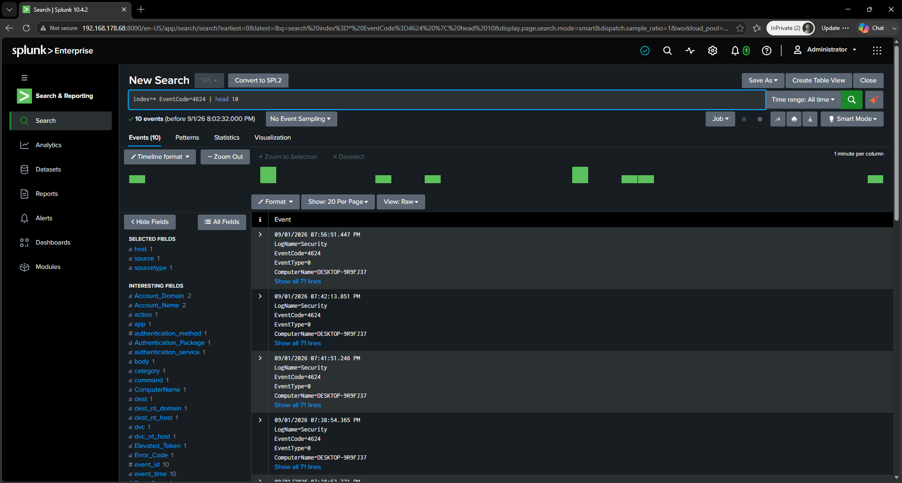
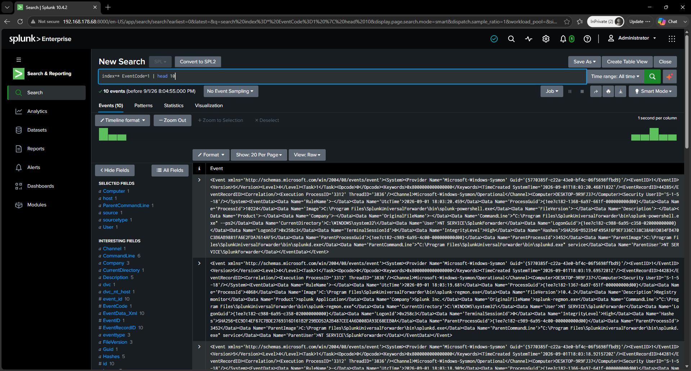
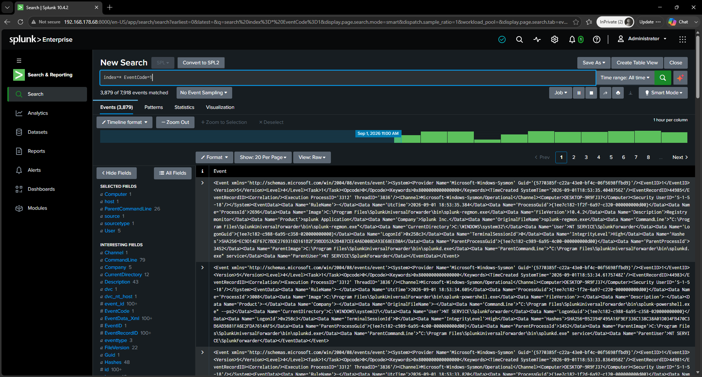

# Detection Evidence

This directory contains visual evidence supporting the security detection and monitoring capabilities developed in the SIEM laboratory.

The evidence demonstrates the progression from endpoint security events to their identification and validation within Splunk.

---

## Detection Evidence Chain

```text
Windows Security Activity
          ↓
Authentication Events
          ↓
Sysmon Process Creation
          ↓
Telemetry Forwarding
          ↓
Splunk Event Search
          ↓
Detection Validation
```

---

## Evidence Register

| Evidence                   | Validation                                                                                 |
| -------------------------- | ------------------------------------------------------------------------------------------ |
| `11-auth-events.png`       | Demonstrates Windows authentication activity, including successful and failed logon events |
| `12-process-creation.png`  | Demonstrates Sysmon Event ID 1 process creation activity on the Windows endpoint           |
| `12-splunk-eventcode1.png` | Confirms process creation telemetry is searchable in Splunk using EventCode 1              |
| `13-whoami-detection-search.png` | Confirms the Atomic Red Team T1033 (`whoami`) discovery test is searchable in Splunk via a targeted process-creation query, with parent-child process linkage intact |

---

## 01 — Authentication Monitoring



This evidence demonstrates Windows authentication activity recorded on the endpoint.

The captured events include:

* Event ID 4624 — successful logon
* Event ID 4625 — failed logon

Authentication telemetry provides a foundation for monitoring account activity and identifying potentially suspicious authentication behaviour.

---

## 02 — Process Creation Monitoring



This evidence demonstrates Sysmon Event ID 1 process creation activity on the Windows endpoint.

Process creation telemetry provides visibility into programs executed on the endpoint and forms an important source of data for security monitoring and threat detection.

---

## 03 — Splunk Process Creation Search



This evidence demonstrates that the Sysmon Event ID 1 process-creation event generated on the Windows endpoint successfully traversed the telemetry pipeline and became searchable within Splunk Search & Reporting.

The search uses:

```text
EventCode=1
```

This connects the endpoint-side Sysmon process creation event with the SIEM-side searchable telemetry.

---

## Detection Engineering Principle

The detection evidence is structured around observable security activity rather than isolated screenshots.

The evidence demonstrates:

1. **Security event generation**
2. **Endpoint telemetry collection**
3. **Telemetry availability in the SIEM**
4. **Search-based validation**

This establishes a foundation for detection engineering and subsequent investigation workflows.

---

## Evidence Integrity

Screenshots should be sanitized before publication.

Do not publish:

* Passwords
* Authentication credentials
* API keys
* Tokens
* Sensitive personal information
* Unnecessary private network information

Evidence is included only where it demonstrates a distinct validation point. Redundant screenshots are intentionally excluded.
