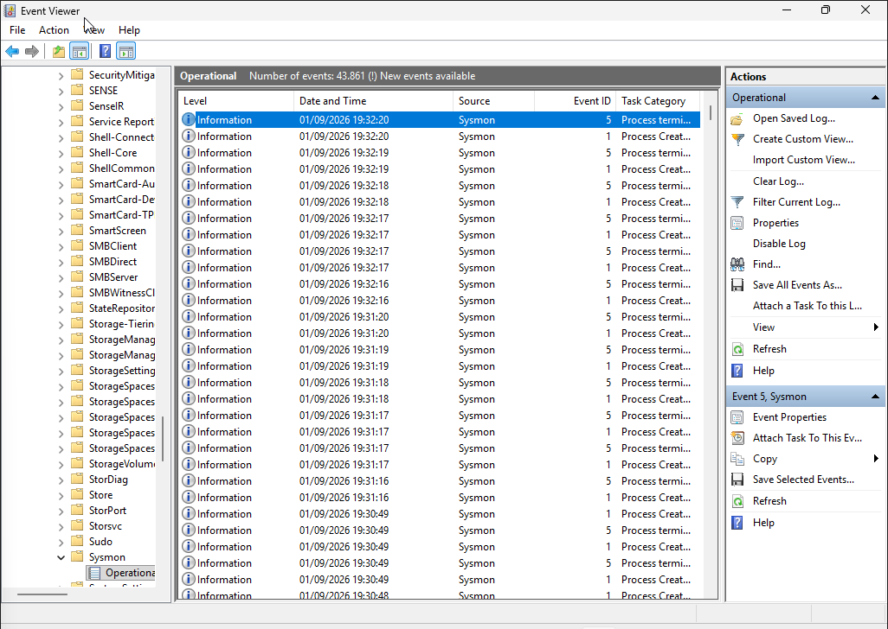
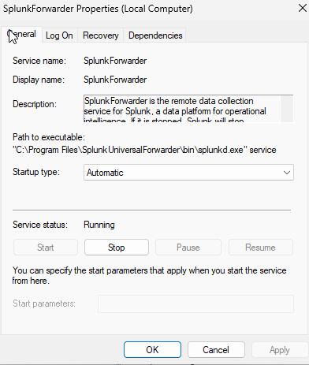
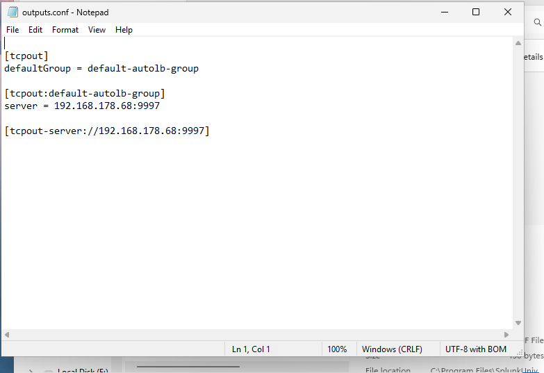
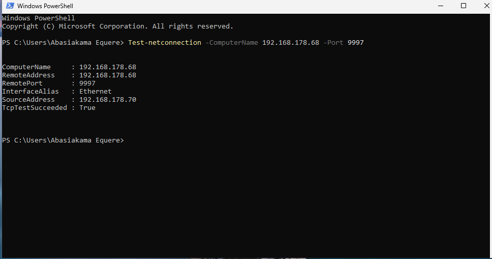
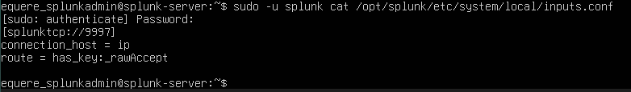

# Telemetry Evidence

This directory contains visual evidence supporting the collection, forwarding, transport, reception, and indexing of Windows endpoint telemetry within the SIEM laboratory.

The evidence demonstrates an end-to-end telemetry pipeline from the Windows endpoint through Sysmon and the Splunk Universal Forwarder to the Splunk receiving service.

---

## Evidence Chain

```text
Windows Endpoint
       ↓
Sysmon
       ↓
Splunk Universal Forwarder
       ↓
outputs.conf
       ↓
TCP 9997
       ↓
Splunk Receiver
       ↓
Indexed Telemetry
       ↓
Splunk Search
````

---

## Evidence Register

| Evidence                             | Validation                                                                    |
| ------------------------------------ | ----------------------------------------------------------------------------- |
| `05-windows-sysmon.png`              | Demonstrates active Sysmon endpoint telemetry                                 |
| `06-universal-forwarder-service.png` | Confirms the Splunk Universal Forwarder service is running                    |
| `07-forwarder-outputs-conf.png`      | Shows the Forwarder's configured telemetry destination                        |
| `08-tcp-connectivity.png`            | Validates TCP connectivity from the Windows endpoint to port 9997             |
| `09-splunk-receiver-conf.png`        | Shows the Splunk server configured to receive forwarded telemetry             |
| `10-splunk-telemetry-search.jpg`     | Confirms endpoint telemetry was successfully indexed and searchable in Splunk |

---

## 01 — Sysmon Endpoint Telemetry



This evidence demonstrates active Sysmon telemetry generation on the Windows endpoint.

Sysmon provides detailed endpoint visibility including process activity and other system events used later for security monitoring and detection engineering.

---

## 02 — Universal Forwarder Service



This evidence confirms that the Splunk Universal Forwarder service is running on the Windows endpoint.

The Forwarder provides the transport mechanism between the endpoint and the Splunk receiving infrastructure.

---

## 03 — Forwarder Output Configuration



This evidence demonstrates the Forwarder's configured output destination.

The configuration establishes where collected endpoint telemetry is forwarded within the laboratory architecture.

---

## 04 — TCP 9997 Connectivity



This evidence demonstrates network-level connectivity between the Windows endpoint and the Splunk receiving service over TCP port 9997.

Successful transport connectivity is an important validation step before troubleshooting telemetry ingestion.

---

## 05 — Splunk Receiver Configuration



This evidence demonstrates the Splunk server-side receiving configuration for forwarded telemetry on TCP port 9997.

Together with the Forwarder configuration and connectivity test, this validates both sides of the telemetry transport path.

---

## 06 — Successful Telemetry Ingestion


This evidence provides the final validation of the telemetry pipeline.

Endpoint events are visible within Splunk Search & Reporting, demonstrating that telemetry successfully travelled from the Windows endpoint through the Universal Forwarder and was indexed by Splunk.

---

## Validation Principle

The evidence is structured to distinguish between:

1. **Event generation**
2. **Forwarder operation**
3. **Forwarding configuration**
4. **Network transport**
5. **Splunk reception**
6. **Successful indexing and searchability**

This provides evidence of an end-to-end telemetry pipeline rather than relying on a single screenshot.

---

## Evidence Integrity

Screenshots should be sanitized before publication.

Do not publish:

* Passwords
* Authentication credentials
* API keys
* Tokens
* Sensitive personal information
* Unnecessary private network information

Redundant screenshots are intentionally excluded when stronger evidence already demonstrates the same validation point.
